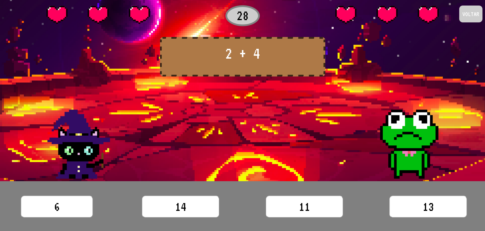

   

 

# Proposta do jogo educativo

 O jogo é voltado, basicamente, para a prática das quatro operações básicas da Matemática (adição, subtração, multiplicação e divisão).  
  Desenvolvemos o jogo aplicando o conceito de <strong> gamificação</strong>, para tornar o software o mais lúdico e divertido possível. 

 

# Ferramentas utilizadas

    

 

# Layout 
## Mundo da Adição
 
 

  

## Mundo da Subtração
 
 

  

## Mundo da Multiplicação
 

  

## Mundo da Adição e Subtração
 

  

## Mundo da Divisão
 

  

## Mundo da Adição, Subtração e Multiplicação
 
 

